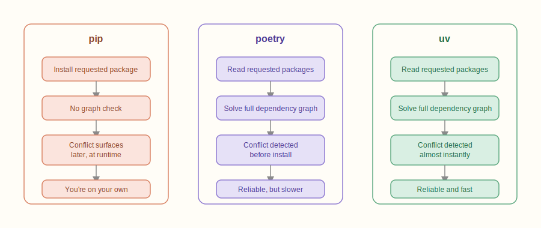
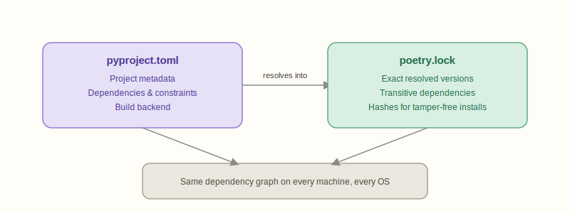
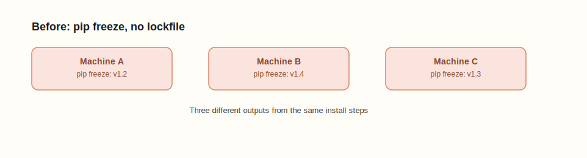
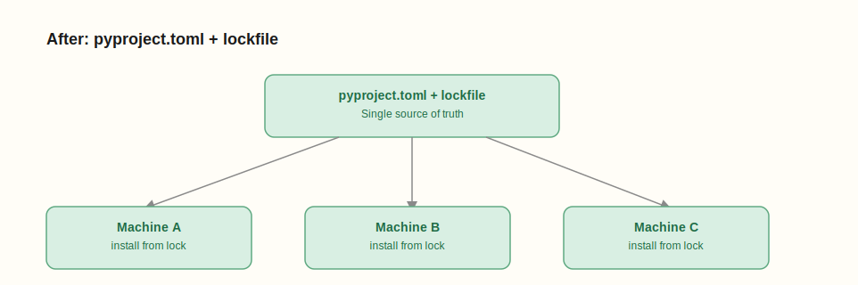
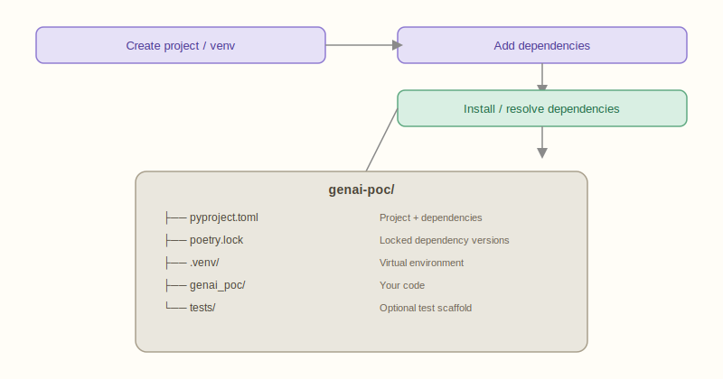

# Choosing the Right Python Package Manager: pip vs poetry vs uv - A GenAI Engineer's Guide

## Overview

**Why package managers matter in GenAI**

In the fast-paced world of Generative AI, *prototyping speed* is everything. One moment, you're experimenting with OpenAI's latest `openai` SDK, and the next, you're tweaking `langchain`, `transformers`, or `llama-index` to fit a client-specific use case.

But before you can generate text, build agents, or fine-tune a model, there's a deceptively mundane but critical question:

> Which Python package manager should I use?

It sounds trivial — until you're stuck debugging version conflicts, broken environments, or worse, "it works on my machine" scenarios. So let's step back and explore your three primary tools: `pip`, `poetry`, and the new speedster on the block — `uv`.

---

## Main Content

### Meet the players

**`pip` – The OG**

- **What it is:** Python's default package installer.
- **Why people use it:** It's pre-installed, simple, and ubiquitous.

```bash
pip install openai
pip freeze > requirements.txt
```

**`poetry` – The Dependency Magician**

- **What it is:** A modern package and dependency manager for Python that uses `pyproject.toml`.
- **Why people use it:** Manages dependencies and virtual environments together. Clean, reproducible, project-level management.

```bash
poetry add langchain
```

**`uv` – The Speed Demon**

- **What it is:** A super-fast package manager (Rust-based) that's compatible with Poetry's project format.
- **Why people use it:** Ridiculously fast installs and resolution. Designed for devs who care about speed and reproducibility.

```bash
uv pip install openai
uv pip add openai
```

### GenAI + Package Management: Why does it matter?

Imagine you're building a POC that involves:

- Using `transformers` for summarization,
- `langchain` for orchestrating tools,
- A vector DB client like `chromadb`,
- Custom OpenAI wrappers.

This stack evolves weekly. You install and uninstall packages frequently. Dependencies shift. You need **reproducibility**, **speed**, and **clean environments**.

This is where understanding the differences between `pip`, `poetry`, and `uv` becomes more than just trivia — it becomes essential to avoid dependency hell.

### Resolving dependencies

Many GenAI libraries have overlapping or conflicting dependencies (e.g., `httpx`, `urllib3`, `pydantic`).

**How they handle it**

| Tool | Behavior |
|------|----------|
| `pip` | Tries to install whatever you ask for. If there's a conflict, you're on your own. |
| `poetry` | Solves the entire dependency graph. It'll tell you if a package won't work before it installs anything. |
| `uv` | Does the same, but almost instantly. |



If you care about **clean, conflict-free environments**, poetry and uv are far more reliable than pip.

### Understanding pyproject.toml: The heart of modern Python projects

If you've used pip, you're probably familiar with `requirements.txt` — a flat list of packages and their versions.

But modern Python tooling (like Poetry and uv) is built around a richer and more structured standard: `pyproject.toml`

**What is pyproject.toml?**

It's a **project manifest** defined by PEP 518 and later PEPs, which:

- Declares your **project's metadata** (name, version, authors)
- Lists **dependencies and constraints**
- Defines your **build backend** (e.g. Poetry, setuptools, Hatch)
- Replaces `setup.py` + `requirements.txt` with a single source of truth

Created automatically by:

```bash
poetry new myproject
poetry init
uv pip add <package>  # creates one if it doesn't exist
```

**What is poetry.lock**

This is **automatically generated** by Poetry (and supported by uv) and contains:

- The **exact versions** of each dependency and sub-dependency
- Their resolved transitive dependencies
- Hashes to validate installs (ensures tamper-free downloads)

> Think of it like `package-lock.json` in Node.

You never edit this manually! It ensures everyone on your team installs the **same dependency graph**, even across OS.

**Why do you need both**

- `pyproject.toml` - Declares what your project needs
- `poetry.lock` - Pins the exact versions to guarantee it works the same every time



Without a lockfile, the same install steps can quietly resolve to different versions on different machines:



With `pyproject.toml` and a lockfile in place, every machine installs from the same resolved graph:



Zooming out, here's where each tool sits in the stack — Poetry and uv both resolve dependencies and produce a lockfile, pip just installs what it's told, and everything ultimately pulls from PyPI:


### Project setup from scratch

**Poetry**

```bash
# Create a new project
poetry new genai-poc
cd genai-poc

# Activate virtual environment
poetry shell

# Add dependencies
poetry add openai langchain llama-index

# Install all (optional if poetry.lock exists)
poetry install

# Resolve dependencies (if you edit pyproject.toml manually)
poetry lock

# Deactivate
exit
```

**UV**

```bash
# Create a new project folder
mkdir genai-poc && cd genai-poc

# Initialize virtual environment
uv venv
source .venv/bin/activate  # Activate it

# Add dependencies (creates pyproject.toml & poetry.lock)
uv pip add openai langchain llama-index

# Install all dependencies (like npm install)
uv pip install

# Resolve dependencies if needed
uv pip resolve

# Deactivate
deactivate
```

At the end, you'll have -

```text
genai-poc/
├── pyproject.toml       # Project + dependencies
├── poetry.lock          # Locked dependency versions
├── .venv/               # Virtual environment
├── genai_poc/           # Your code
└── tests/               # Optional test scaffold
```



## Key Takeaways

`pyproject.toml` is the **modern standard** for defining Python projects.

It's the **backbone of Poetry and uv**.

If you're constantly experimenting with GenAI SDKs, `pyproject.toml` gives you a clean, fast, and repeatable setup — no more guessing which versions work.

## Related Topics

- Python Tooling
- Virtual Environments
- Dependency Management
- GenAI Engineering
