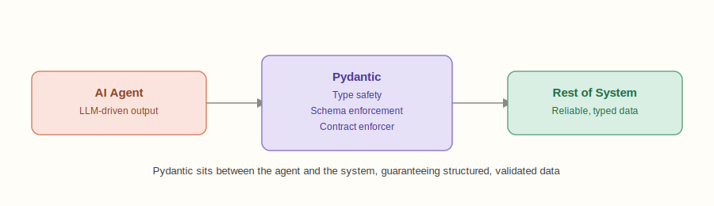
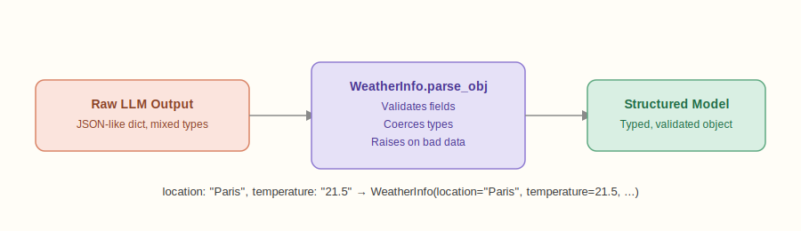

# Mastering Pydantic for Agentic AI Development – A Practical Cheat Sheet

## Overview

**Background & Why This Matters**

Agentic AI systems — such as autonomous research assistants, multi-step planners, or workflow orchestration agents — require reliable handling of **structured inputs and outputs**.

One of the biggest challenges when building such systems is that **LLMs often produce unpredictable or malformed outputs**. If your agent is supposed to return JSON but gives you a half-finished sentence instead, your entire pipeline can break.

This is where **Pydantic** comes in. Originally designed as a data validation and settings management library for Python, Pydantic has become a **cornerstone in Agentic AI** because it:

- **Data Validation**: Ensures **type safety** and **schema enforcement** for agent outputs.
- **Schema Generation**: Integrates seamlessly with **LLM frameworks** like LangChain, LlamaIndex, or OpenAI's function calling.
- **Ease of Use**: Makes debugging and validation **simple, declarative, and fast**.

Think of it as the **contract enforcer** between your AI agent and the rest of your system.



Below is a **step-by-step cheat sheet** of the most useful Pydantic features in Agentic AI workflows.

---

## Main Content

### 1. Defining Basic Models

Start simple with typed models that enforce structure.

```python
from pydantic import BaseModel

class Task(BaseModel):
    id: int
    name: str
    completed: bool = False

task = Task(id=1, name="Write LinkedIn Post")
print(task.dict())
```

- Ensures every `Task` has the correct types.
- Invalid types raise a `ValidationError`.

### 2. Type Validation with Lists and Optionals

Easily handle collections and optional fields.

```python
from typing import List, Optional
from pydantic import BaseModel

class AgentConfig(BaseModel):
    name: str
    tools: List[str]
    memory_limit: Optional[int] = None

config = AgentConfig(name="ResearchAgent", tools=["search", "summarize"])
```

### 3. Nested Models for Complex Structures

Model agents, tools, and environments hierarchically.

```python
class Tool(BaseModel):
    name: str
    description: str

class Agent(BaseModel):
    name: str
    tools: list[Tool]

agent = Agent(
    name="Planner",
    tools=[Tool(name="Calendar", description="Schedules tasks")]
)
```

### 4. Automatic Data Coercion

Messy inputs? Pydantic will coerce types when possible.

```python
class Event(BaseModel):
    date: str
    duration: int

event = Event(date=20250910, duration="45")
print(event.dict())
```

### 5. Custom Validation with @validator

Apply logic rules beyond type checks.

```python
from pydantic import BaseModel, validator

class Message(BaseModel):
    sender: str
    text: str

    @validator("text")
    def must_not_be_empty(cls, v):
        if not v.strip():
            raise ValueError("Message text cannot be empty")
        return v
```

### 6. Value Constraints

Restrict numbers, strings, and ranges for safety.

```python
from pydantic import constr, conint

class LLMRequest(BaseModel):
    prompt: constr(min_length=5, max_length=500)
    temperature: conint(ge=0, le=1)
```

### 7. Field Metadata & Defaults

Add constraints, docs, and better defaults.

```python
from pydantic import BaseModel, Field

class Plan(BaseModel):
    step: str = Field(..., description="The step of the plan")
    priority: int = Field(default=1, ge=1, le=5)
```

### 8. Aliases for API Integration

Map external API keys into clean model attributes.

```python
class LLMResponse(BaseModel):
    text: str = Field(..., alias="generated_text")

resp = LLMResponse(generated_text="Hello world!")
print(resp.text)
```

### 9. LLM Integration Example

```python
class WeatherInfo(BaseModel):
    location: str
    temperature: float
    condition: str

# Perfect for function calling or structured output parsing
```

### 10. Model Config & Strict Mode

Lock down extra fields and enforce runtime safety.

```python
class ConfigModel(BaseModel):
    class Config:
        extra = "forbid"   # reject unexpected fields
        validate_assignment = True  # check updates too
```

### 11. Parsing LLM Outputs with .parse_obj

Convert raw JSON-like responses into structured models.

```python
raw_output = {"location": "Paris", "temperature": "21.5", "condition": "Sunny"}
weather = WeatherInfo.parse_obj(raw_output)
print(weather.dict())
```



## Key Takeaways

Pydantic isn't just about Python data validation — it's a **key enabler of Agentic AI**. By enforcing schemas, coercing messy outputs, and guarding against malformed data, it ensures your agents stay predictable and reliable.

## Related Topics

- Python Tooling
- Agentic AI
- LLM Integration
- Data Validation
